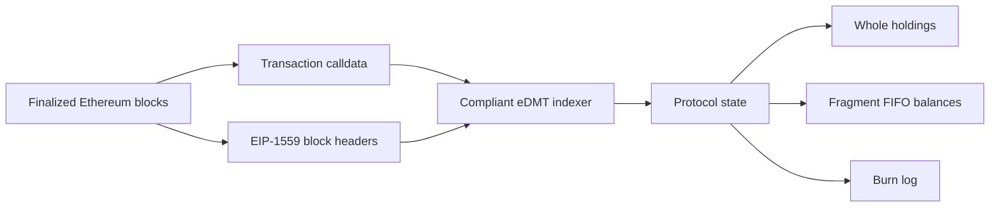
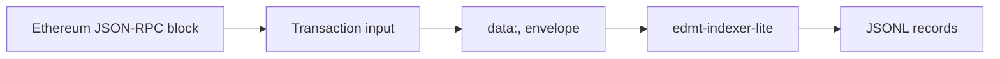

<h1 align="center">eDMT Protocol</h1>

<p align="center">
  <strong>Ethereum Digital Matter</strong><br>
  A calldata-only asset protocol for Ethereum.
</p>

<p align="center">
  
  
  
  
  
  
</p>

---

## Abstract

eDMT derives asset state from Ethereum history rather than from contract storage.

Protocol operations are ordinary Ethereum transactions whose calldata contains a small JSON payload. A compliant indexer replays finalized chain history, reads EIP-1559 block data, and derives the same state as every other compliant indexer.

`enat` is the first ticker defined by this specification. Each minted unit is bound to one Ethereum block and carries the amount of ETH burned by that block, measured in gwei.

> [!IMPORTANT]
> eDMT is not a token contract. The base protocol has no contract storage, no protocol administrator, no pause function, and no upgrade key. This repository specifies the protocol layer only.

## Core Thesis

eDMT turns Ethereum block burn into a permissionless mint-right market.

Every Ethereum block produces a burn event. eDMT lets anyone compete to capture that event with calldata. The first valid mint in canonical chain order owns that block's eNAT.

The protocol does not sell mints, set a mint price, run a whitelist, or define a bonding curve. Ethereum blockspace itself prices the mint right.

eNAT is not a redemption claim on burned ETH. It is a provenance claim over a specific Ethereum burn event.

## Protocol Invariants

| Property | Rule |
| --- | --- |
| Execution surface | Ethereum transaction calldata |
| Protocol contract | None |
| State source | Finalized Ethereum history |
| Element | `burn(N) = floor(baseFeePerGas(N) * gasUsed(N) / 10^9)` |
| Unit | gwei |
| First ticker | `enat` |
| Mint rule | One valid block can be claimed once |
| Capture fee | Post-activation mint targets pay from raw fragment balance |
| Conflict rule | First valid transaction in canonical chain order wins |
| Transfer model | Whole holdings plus FIFO fragment balances |
| Upgrade key | None at the protocol layer |

## Operation Set

| Operation | Purpose |
| --- | --- |
| `emt-deploy` | Register a ticker against the burn element |
| `emt-mint` | Claim one block as one whole eNAT |
| `emt-transfer` | Transfer a whole holding or fragment amount |
| `emt-batch-transfer` | Execute multiple transfers atomically |
| `emt-burn` | Permanently remove protocol supply |

## Calldata Form

Every protocol operation is encoded as:

```text
data:,<json>
```

Example mint:

```text
data:,{"p":"edmt","op":"emt-mint","tick":"enat","blk":"1705479"}
```

Example transfer:

```text
data:,{"p":"edmt","op":"emt-transfer","tick":"enat","amt":"500000","to":"0x3333333333333333333333333333333333333333","src":"balance"}
```

## Deterministic State



The protocol is not a contract API. It is a deterministic interpretation of public Ethereum data.

## Runnable Scanner

<p align="center">
  
  
  
  
</p>

This repository includes a minimal runnable scanner:

[`implementations/rust/edmt-indexer-lite/`](implementations/rust/edmt-indexer-lite)

It fetches Ethereum blocks through JSON-RPC, scans transaction `input` fields,
recognizes `data:,` envelopes, parses known eDMT operation payloads, and writes
JSONL records.



Quickstart:

```sh
cd implementations/rust/edmt-indexer-lite
cargo run -- \
  --rpc-url "https://example.invalid/rpc" \
  --from-block 12965000 \
  --to-block 12965010
```

Example output:

```json
{"block_number":12965000,"tx_hash":"0x...","classification":"parsed","operation":"emt-mint","payload":{"p":"edmt","op":"emt-mint","tick":"enat","blk":"12965000"}}
```

The scanner is deliberately not a full indexer. It does not maintain canonical
balances, finality, reorg handling, capture fee accounting, or application
state. A `parsed` record means the calldata envelope was parsed; it is not a
state-validity claim.

## Repository Map

| Path | Description |
| --- | --- |
| [`docs/protocol.md`](docs/protocol.md) | Authoritative protocol rules |
| [`docs/indexer.md`](docs/indexer.md) | Required behavior for deterministic indexers |
| [`docs/calldata.md`](docs/calldata.md) | Encoding guide and examples |
| [`docs/examples/`](docs/examples) | Machine-readable JSON examples, including capture-fee mint payloads |
| [`docs/reference-indexer.md`](docs/reference-indexer.md) | Non-normative notes for the runnable Rust scanner |
| [`implementations/rust/edmt-indexer-lite/`](implementations/rust/edmt-indexer-lite) | Minimal runnable calldata scanner and parser |

## Scope

This repository contains:

- protocol rules for deploy, mint, transfer, batch transfer, and burn;
- capture-fee semantics for post-activation mint targets;
- deterministic indexer behavior required for state convergence;
- calldata encoding rules and examples;
- a minimal non-normative Rust calldata scanner and parser.

This repository does not contain:

- API implementation code;
- frontend code;
- deployment scripts;
- infrastructure, monitoring, private runbooks, or operational material;
- application-layer contract specifications.

## Conformance

A compliant indexer must:

- compute `burn(N)` from Ethereum block headers using integer arithmetic;
- process blocks and transactions in canonical order;
- apply first-is-first mint resolution;
- enforce capture fee for post-activation mint targets;
- preserve the distinction between whole holdings and FIFO fragments;
- implement atomic batch transfer;
- treat protocol burn as distinct from zero-address transfer;
- ignore unknown fields and unknown operations as specified.

See [Indexer Specification](docs/indexer.md) for the complete checklist.

## License

Specification text and examples are published under the Creative Commons Attribution 4.0 International license. See [LICENSE](LICENSE).

Code is published under `MIT OR Apache-2.0`. See [LICENSE-MIT](LICENSE-MIT) and [LICENSE-APACHE](LICENSE-APACHE).
