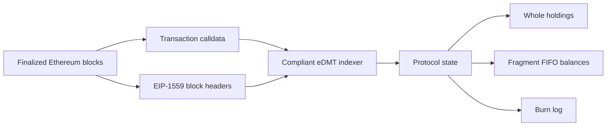

<h1 align="center">eDMT Protocol</h1>

<p align="center">
  <strong>Ethereum Digital Matter</strong><br>
  A calldata-only asset protocol for Ethereum.
</p>

<p align="center">
  
  
  
  
  
</p>

---

## Abstract

eDMT derives asset state from Ethereum history rather than from contract storage.

Protocol operations are ordinary Ethereum transactions whose calldata contains a small JSON payload. A compliant indexer replays finalized chain history, reads EIP-1559 block data, and derives the same state as every other compliant indexer.

`enat` is the first ticker defined by this specification. Each minted unit is bound to one Ethereum block and carries the amount of ETH burned by that block, measured in gwei.

> [!IMPORTANT]
> eDMT is not a token contract. The base protocol has no contract storage, no protocol administrator, no pause function, and no upgrade key. This repository specifies the protocol layer only.

## Protocol Invariants

| Property | Rule |
| --- | --- |
| Execution surface | Ethereum transaction calldata |
| Protocol contract | None |
| State source | Finalized Ethereum history |
| Element | `burn(N) = floor(baseFeePerGas(N) * gasUsed(N) / 10^9)` |
| Unit | gwei |
| First ticker | `enat` |
| Mint rule | One valid block can be claimed once |
| Conflict rule | First valid transaction in canonical chain order wins |
| Transfer model | Whole holdings plus FIFO fragment balances |
| Upgrade key | None at the protocol layer |

## Operation Set

| Operation | Purpose |
| --- | --- |
| `emt-deploy` | Register a ticker against the burn element |
| `emt-mint` | Claim one block as one whole eNAT |
| `emt-transfer` | Transfer a whole holding or fragment amount |
| `emt-batch-transfer` | Execute multiple transfers atomically |
| `emt-burn` | Permanently remove protocol supply |

## Calldata Form

Every protocol operation is encoded as:

```text
data:,<json>
```

Example mint:

```text
data:,{"p":"edmt","op":"emt-mint","tick":"enat","blk":"1705479"}
```

Example transfer:

```text
data:,{"p":"edmt","op":"emt-transfer","tick":"enat","amt":"500000","to":"0x3333333333333333333333333333333333333333","src":"balance"}
```

## Deterministic State



The protocol is not a contract API. It is a deterministic interpretation of public Ethereum data.

## Repository Map

| Path | Description |
| --- | --- |
| [`docs/protocol.md`](docs/protocol.md) | Authoritative protocol rules |
| [`docs/indexer.md`](docs/indexer.md) | Required behavior for deterministic indexers |
| [`docs/calldata.md`](docs/calldata.md) | Encoding guide and examples |
| [`docs/examples/`](docs/examples) | Machine-readable JSON examples |

## Scope

This repository contains:

- protocol rules for deploy, mint, transfer, batch transfer, and burn;
- deterministic indexer behavior required for state convergence;
- calldata encoding rules and examples.

This repository does not contain:

- indexer implementation code;
- API implementation code;
- frontend code;
- deployment scripts;
- infrastructure, monitoring, private runbooks, or operational material;
- application-layer contract specifications.

## Conformance

A compliant indexer must:

- compute `burn(N)` from Ethereum block headers using integer arithmetic;
- process blocks and transactions in canonical order;
- apply first-is-first mint resolution;
- preserve the distinction between whole holdings and FIFO fragments;
- implement atomic batch transfer;
- treat protocol burn as distinct from zero-address transfer;
- ignore unknown fields and unknown operations as specified.

See [Indexer Specification](docs/indexer.md) for the complete checklist.

## License

The text in this repository is published under the Creative Commons Attribution 4.0 International license. See [LICENSE](LICENSE).
